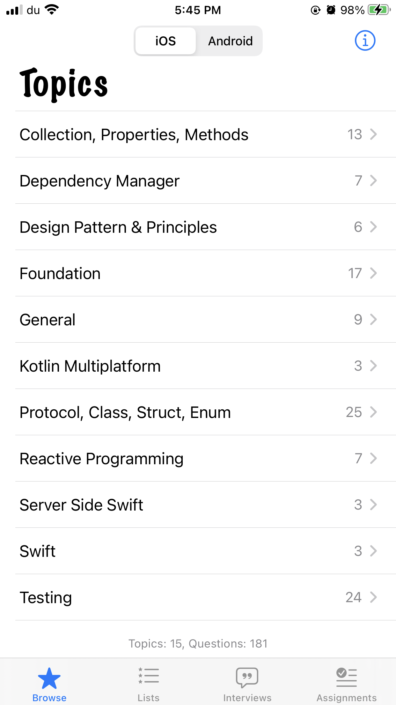
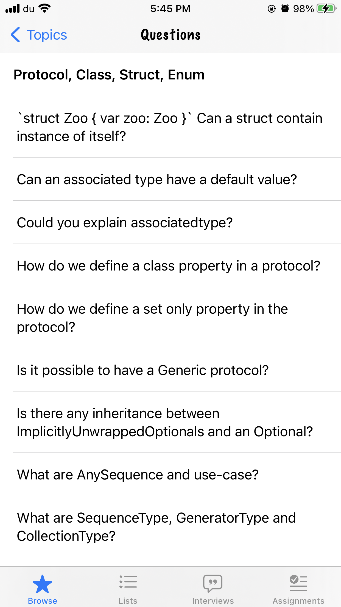
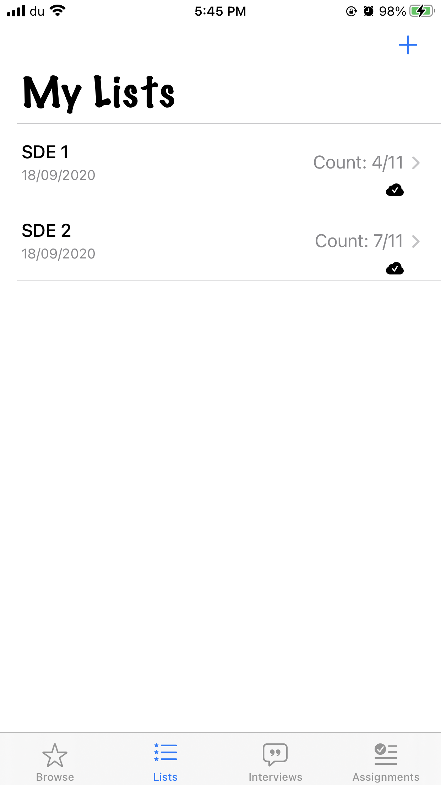
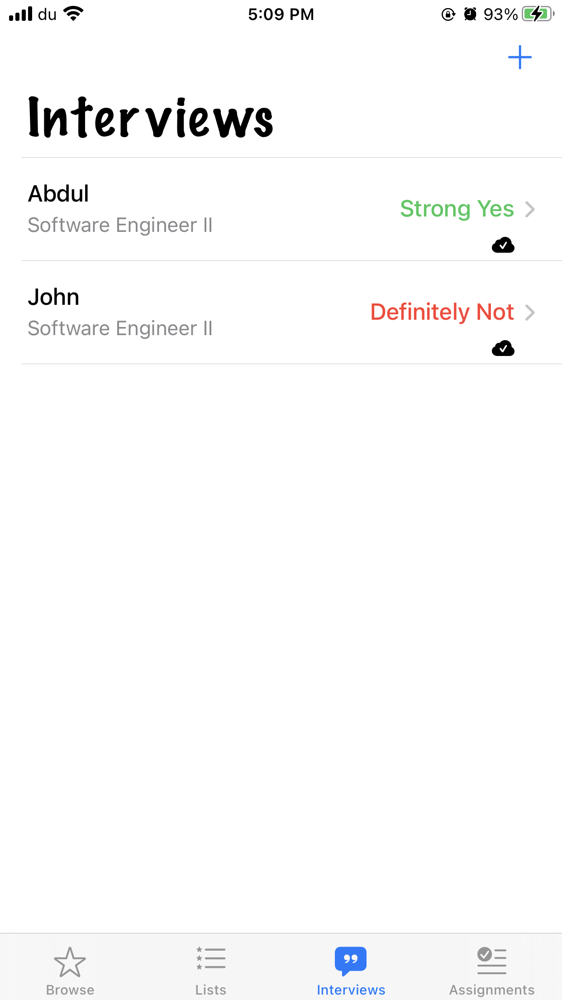
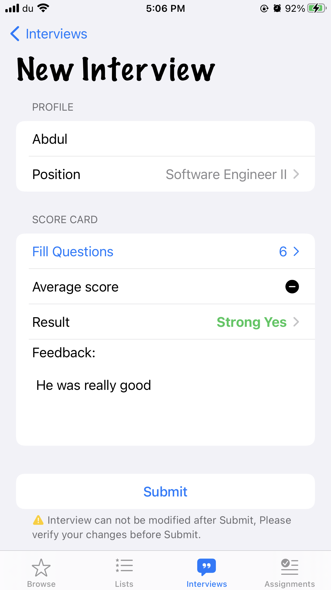
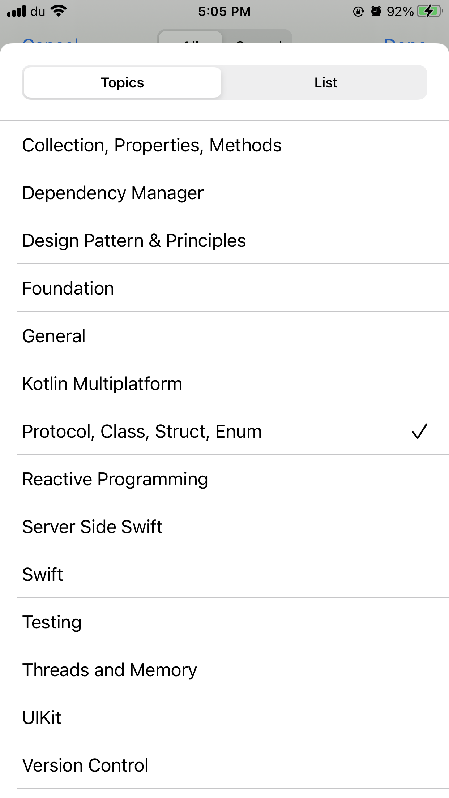
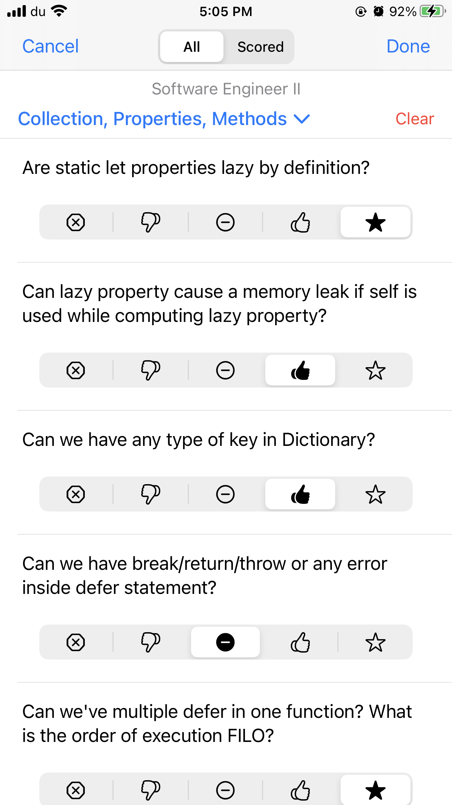
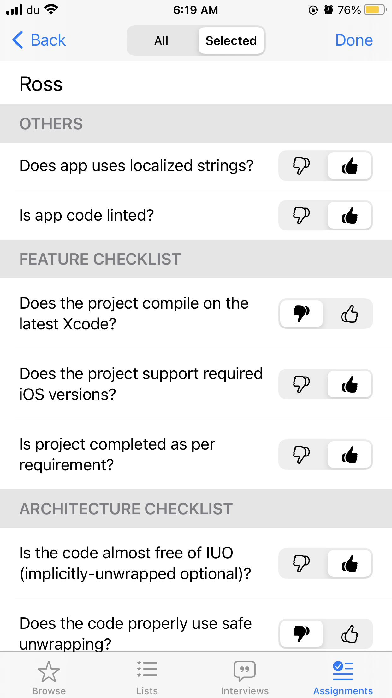

# Hired

Hired is an iOS, iPadOS and soon to be on macOS application to take interviews.
It has following features:

- Browse all question under different topics.
- Create your own list of selected questions.
- Take an interview from your own questions list.
- A checklist for reviewing iOS assignments (WIP).

Below are some of the screenshots of the application.

    
    
    
    
    
    
    
    

This repository is a question bank from where Hired app gets all its content. You can contribute to the question bank by raising a Pull Request.
Content is located in Resources folder `Hired/Sources/Hired/Resources/iOS.json`.

Currently, This repository does not have code for the actual application.
